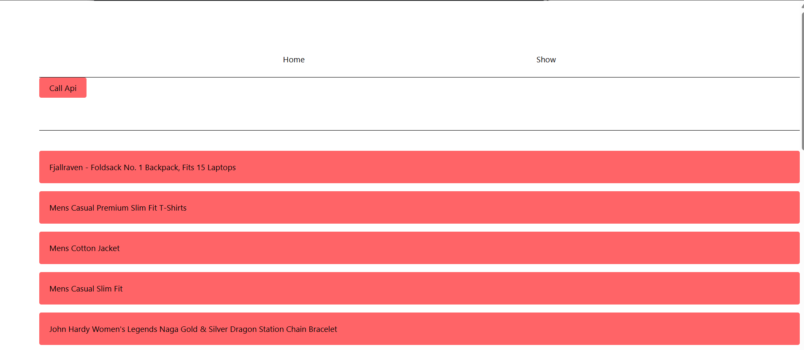

# API Basics with React + Vite

A learning project to understand API integration in React using Axios, with routing and Tailwind CSS styling.

## 🛠 Tech Stack

- React 18.3
- Vite 6.0
- Axios
- React Router DOM
- Tailwind CSS
- ESLint

## 🚀 Key Features

- API integration with [Fake Store API](https://fakestoreapi.com/)
- React Router for navigation
- Responsive design with Tailwind CSS
- Modern React practices (Hooks, Components)

## 📝 Learning Points

1. **API Integration**
   - Using Axios for HTTP requests
   - Handling API responses
   - State management with useState hook

2. **React Router Setup**
   - Basic routing configuration
   - Navigation between components
   - Link component usage

3. **Component Structure**
   - App.jsx as main component
   - Home.jsx for landing page
   - Show.jsx for API data display

## 🏃‍♂️ Running the Project

```bash
# Install dependencies
npm install

# Run development server
npm run dev

# Build for production
npm run build
```

## 💡 Code Snippets

### API Call Example
```jsx
const getProducts = () => {
  const api = "https://fakestoreapi.com/products";
  axios
    .get(api)
    .then((response) => {
      setProducts(response.data);
    })
    .catch((err) => console.log(err));
};
```

### Router Setup
```jsx
<Routes>
  <Route path='/home' element={<Home/>} />
  <Route path='/show' element={<Show/>} />
</Routes>
```

## 📸 Screenshots



## 🎥 Demo


## 📚 Future Reference

- Check [Axios Documentation](https://axios-http.com/docs/intro) for advanced API handling
- Explore [React Router Documentation](https://reactrouter.com/) for complex routing
- Visit [Tailwind CSS Documentation](https://tailwindcss.com/docs) for styling options


